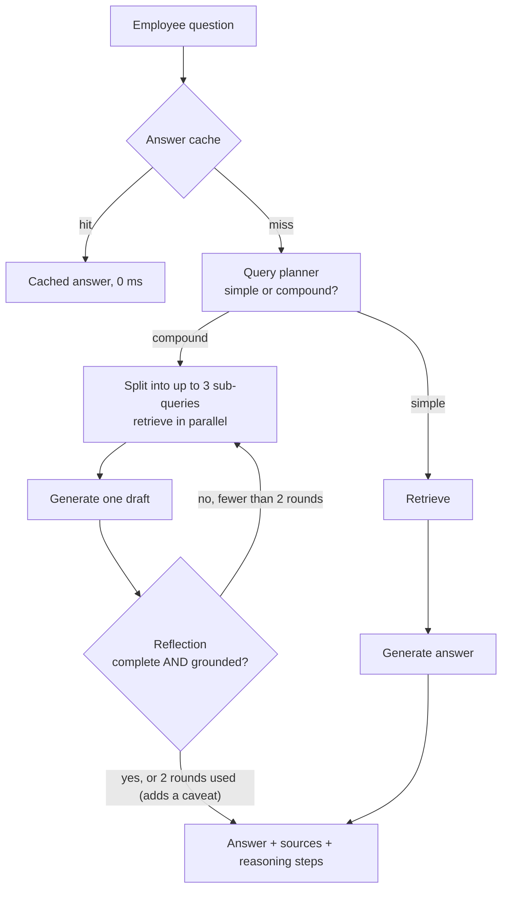
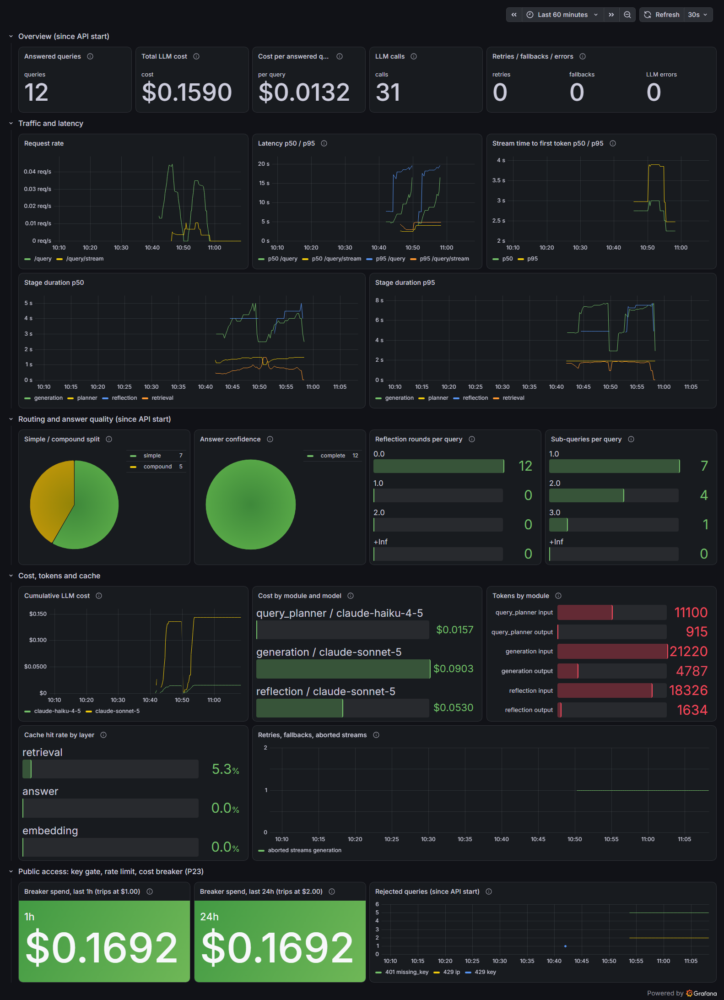

# Adaptive RAG

**An internal knowledge assistant that answers employee policy questions from company documents. It spends extra effort only on questions that need it, and says "I don't know" instead of inventing policy.**

Built solo, end to end: design, implementation, evaluation and optimization, each step verified against real infrastructure. The source repository is private. A live demo is available on request during interviews.

## The problem

Employees ask HR the same policy questions every day: leave days, expense claims, travel approval. A basic RAG chatbot handles simple lookups, but breaks in two ways that matter in HR:

1. **Compound questions.** "I'm travelling for 3 days. How far ahead do I apply, and how do I claim expenses?" spans two policy documents. A single retrieval pass usually finds only one.
2. **Invented answers.** When the documents don't cover something, a plain LLM fills the gap with plausible policy that doesn't exist. In HR, a confident wrong answer is worse than no answer.

## How it works

Every answer comes with its source citations and `reasoning_steps`, showing the path taken, the sub-queries, the reflection rounds and the confidence. Real responses: [`samples/simple-question.json`](./samples/simple-question.json) and [`samples/compound-question.json`](./samples/compound-question.json).

## Five design decisions

1. **Two paths, chosen per question.** Simple questions skip the reflection loop entirely, so they don't pay for checking they don't need.
2. **Groundedness is checked separately from completeness.** An answer can be complete and still invented. The reflection step flags any claim the retrieved text doesn't support.
3. **Hard caps instead of open-ended agents.** At most 3 sub-queries and 2 reflection rounds. Every request is bounded to a handful of LLM calls, so cost and latency stay predictable.
4. **Honest degradation.** If the cap is reached, the answer is returned with an explicit caveat rather than presented as complete.
5. **Every model choice measured, not assumed.** A cheaper model handles classification after scoring 10/10, identical to the larger model, at about twice the speed. Answer generation and reflection keep the stronger model at reduced thinking effort, after a three-way comparison where the hallucination test held at every level.

## Measured results

10 test questions (5 simple, 5 compound), real database, real LLM API:

| | Baseline | Current | Change |
|---|---|---|---|
| Questions answered correctly | 10 / 10 | 10 / 10 | — |
| Simple questions, average latency | 7.0 s | 4.7 s | −33% |
| Compound questions, average latency | 15.7 s | 11.4 s | −28% |
| Cost for all 10 questions | $0.169 | $0.147 | −13% |
| Faithfulness (RAGAS): answers grounded in sources | — | 0.97 | — |

- **The hallucination trap passes every time.** One test asks about a situation the documents never cover. The system says so and points to HR, instead of making up a policy.
- **The original latency targets are not met:** under 3 s for simple questions and under 5 s for compound ones. Each request still makes 2–4 sequential LLM calls. The optimizations made those calls cheaper and faster, and parallelized retrieval, but didn't remove a call from the chain.
- **Streaming** gets the first words of a simple answer on screen in about 2.4 s.

## Real bugs found and fixed

All mocked tests passed throughout. These appeared only against real infrastructure:

- **Evidence hidden from the model.** Retrieved text was cut to 200 characters inside the prompt. One chunk held the answer one line after the cut, so answers hedged. The prompt now gets full text; the cut applies only to the citation preview.
- **A fix that broke something downstream.** Sending full text made the reflection step's output longer than its token limit, so its structured output stopped mid-object and crashed the loop. The limits were raised, and guards were added so a truncated response degrades safely.
- **Two bugs inside an evaluation library** (RAGAS 0.4.3): an import of a module its own dependency had removed, and a parameter the current LLM SDK no longer accepts. Both were diagnosed from the library's source and worked around narrowly.
- **A database that paused itself.** The free-tier database went to sleep after about 20 days unused, and every query failed. A readiness check (`/ready`) now reports it before any traffic is sent; a daily keep-alive job is planned.
- **A streamed answer that kept running after the user left.** When a client disconnected mid-answer, the web framework stopped reading the stream but never closed it, so the model call was never recorded by the metrics or the cost breaker, and its connection stayed open. Found by testing a real disconnect; the earlier mocked test had closed the stream by hand. Fixed, with a regression test that fails on the old behaviour.
- **A dashboard that starved itself.** Grafana thrashed at 1,100% CPU under a 256 MB memory limit while rendering the dashboard below. Its real peak was measured and the limit set from that.

## Production readiness

**Done and verified against real infrastructure:**

- **Observability.** Prometheus metrics and a Grafana dashboard: per-stage latency, cost per query and per model, cache hit rate, reflection rounds, aborted streams. Every request gets an ID and one JSON log line with its token cost. The metrics' cost figures match the evaluation script's own count exactly.
- **A smaller, offline-capable image.** CPU-only PyTorch and the embedding weights baked in: 10.3 GB → 2.28 GB, idle memory 728 → 454 MiB, and it starts and answers with Hugging Face unreachable.
- **Kubernetes.** A Helm chart (one replica on purpose: the caches and limits live in memory) with liveness and readiness probes, deployed into a kind cluster on every push in CI.
- **Protection for public access.** An API-key gate that fails closed, per-client rate limiting, and a cost circuit breaker ($1/hour, $2/day) on top of a hard $5/month spend cap. The thresholds were checked against the most expensive request the system can make: $0.072, measured.

**Next:** an on-demand AWS demo: Terraform, ECR, SSM, deployment through GitHub Actions with OIDC, no SSH and no long-lived keys.

## Tech stack

Python, FastAPI · Claude (Haiku 4.5 and Sonnet 5) through the Anthropic SDK, with forced tool use for structured output · local sentence-transformers embeddings · Postgres + pgvector · Docker · pytest and GitHub Actions · RAGAS · no framework (no LangChain), so every step maps to a decision that can be explained.

---

Source code is in a private repository. Happy to walk through it and run a live demo in an interview.
